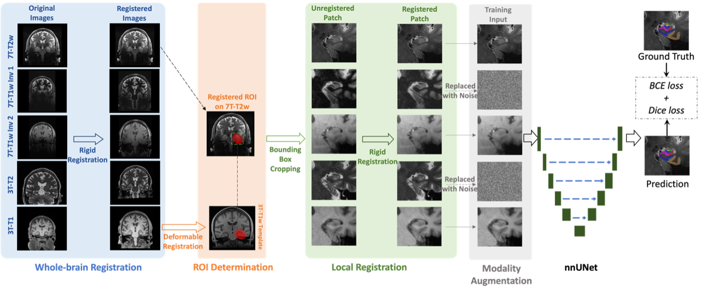
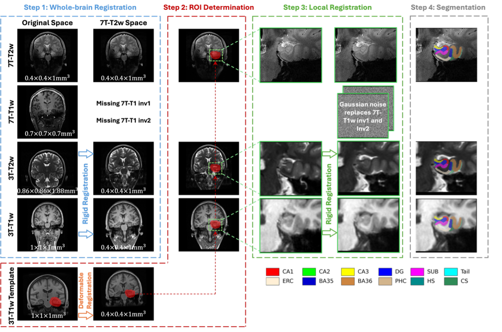
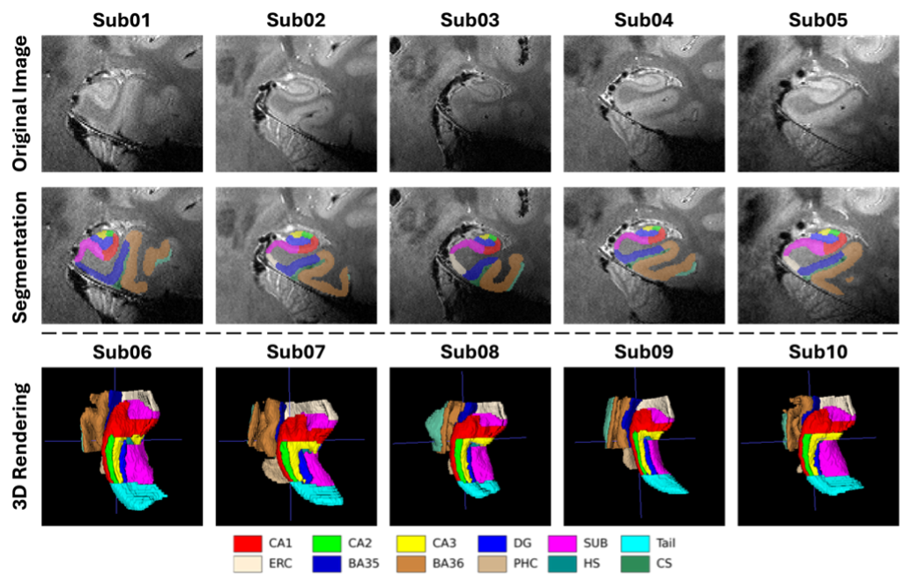

# Overview
`mmseg` is a robust pipeline designed for medial temporal lobe (MTL) subregion segmentation using multi-modality brain MRI data (7T and 3T). The details of the method can be found in our [paper](https://www.biorxiv.org/content/10.1101/2024.05.21.595190v1)
```bash
Li, Y., Xie, L., Khandelwal, P., Wisse, L.E., Brown, C.A., Prabhakaran, K., Tisdall, M.D., Mechanic-Hamilton, D., Detre, J.A., Das, S.R. and Wolk, D.A., 2024. Automatic segmentation of medial temporal lobe subregions in multi-scanner, multi-modality MRI of variable quality. bioRxiv.
```


*Training Pipeline*

# Dependencies
This project requires the following dependencies to be installed before use:

- [`nnUNet with modality augmentation`](https://github.com/liyue3780/nnUNet/tree/mmseg): A customized fork of nnUNet. Please clone and install it from the provided link.

## Installation Instructions

1. Clone the forked `nnUNet` repository and check out the `mmseg` branch:
   ```bash
   git clone https://github.com/liyue3780/nnUNet.git
   cd nnUNet
   git checkout mmseg

2. Install the nnUNet package:
    ```bash
    pip install -e .

3. Ensure all other dependencies are installed. You can find the full list of dependencies in the `requirements.txt` file of this repository.
    ```bash
    pip install -r requirements.txt

### Compatibility
- The customized `nnUNet`  was developed with **Python 3.10**
- Tested with **PyTorch 1.13.0 + CUDA 11.7**
- Its `mmseg` branch was created by checking out commit [`b624fb9`](https://github.com/MIC-DKFZ/nnUNet/commit/b624fb9) from the official nnU-Net repository (`v2.3.1`), which includes support for custom architectures via the updated `plans.json` mechanism.

# Usage

### 1. Data Availability
- **Training Data & Manual Segmentations**  
    The training data and corresponding manual segmentations (following Penn Aging Brain Cohort (ABC) protocol) have been published and are available via [Dryad](doi). The training set has been well registered to the 7T-T2w modality. Due to the need for anonymity, it is in nnUNet standard training data format, you don't have to reformat it. The fake image IDs are organized such that every two consecutive IDs (e.g., `001` and `002`, `009` and `010`) corresponds to the left and right sides of the same subject, respectively. The cross-validation folds should be splitted based on subjects. The `splits_final.json`, which saves the five-fold cross-validation splits in our training process, has been provided along with the training data. It should be manually copied to the preprocessed folder [nnUNet_preprocessed](https://github.com/MIC-DKFZ/nnUNet/blob/master/documentation/set_environment_variables.md) (e.g. `nnUNet_preprocessed/DatasetXXX_MYDATASET/`) if you need to used it.

- **Trained Model Checkpoint**  
    If you want to run our trained model directly on your own data, you can download our [nnUNet checkpoint](doi2) trained with five-fold cross-validation. The trained model should be placed under folder [nnUNet_results](https://github.com/MIC-DKFZ/nnUNet/blob/master/documentation/set_environment_variables.md) (e.g. `nnUNet_results/DatasetXXX_MYDATASET/`) as expected by nnU-Net. Finally, you can follow [Step 3](#3-run-inference) to run the inference.

- **Test Data**  
    We use an independent public dataset released by [Chu et al.](https://www.nature.com/articles/s41597-025-04586-9) in [**A paired dataset of multi-modal MRI at 3 Tesla and 7 Tesla with manual hippocampal subfield segmentations, 2025** (2025)](https://www.nature.com/articles/s41597-025-04586-9). Please download the dataset from [Figshare+ Link](https://plus.figshare.com/articles/dataset/A_paired_dataset_of_multi-modal_MRI_at_3_Tesla_and_7_Tesla_with_manual_hippocampal_subfield_segmentations_on_7T_T2-weighted_images/26075713/1). Since the correspondence author is from Beijing Normal University, China, we call this dataset **BNU dataset** for short. If you use their dataset in your work, please cite the original paper: 
```bash
Chu, L., Ma, B., Dong, X., He, Y., Che, T., Zeng, D., Zhang, Z. and Li, S., 2025. A paired dataset of multi-modal MRI at 3 Tesla and 7 Tesla with manual hippocampal subfield segmentations. Scientific Data, 12(1), p.260. (https://doi.org/10.1038/s41597-025-04586-9). 
```


### 2. Training the Model
After the customized nnU-Net has been installed and the training data has been converted into the expected format (as described above), you can train the model using the following command. (We use 600 as Dataset ID in the following examples)

a. **Preprocess the dataset**  
    Run the following command to generate the necessary planning and preprocessed data:

```bash
nnUNetv2_plan_and_preprocess -d 600 --verify_dataset_integrity
```

b. **Train the model (using fold 0 as an example)**
```bash
nnUNetv2_train 600 3d_fullres 0 -tr ModAugAllFourUNetTrainer
```

### 3. Run Inference
For inference, we suppose the data are raw data. The different modalities of whole-brain MRI will be input into our proposed pipeline. Therefore, all steps in the pipeline including `1. whole-brain registration`, `2. ROI determination`, `3. local registration` and `4. subregion segmentation` will be run.

The test dataset must follow a fixed naming format. Specifically:

- All test images for the same subject should be placed in the same folder (e.g., `sub01/`)
- Each image file must follow the naming convention:  
    - `image_7tt2.nii.gz`
    - `image_7tt1_inv1.nii.gz`
    - `image_7tt1_inv2.nii.gz`
    - `image_3tt2.nii.gz`
    - `image_3tt1.nii.gz`
- If certain modality is not available, you can just ignore it

[`examples/test.py`](https://github.com/liyue3780/mmseg/blob/main/examples/prepare_bnu_dataset.py) demonstrates how to run the format convertion from BNU dataset to our required format.

After format convertion, you can run the following command to finish the segmentation pipeline implementation:
```bash
python src/run_inference.py --dataset_path path/to/dataset --template_path path/to/3tt1/template
```
where `dataset_path` is the folder that saves all subjects with standard whole-brain images (after name convertion) and `template_path` is the folder that saves the 3T-T1w template (downloaded template [here](fake_link)).  

Segmentations will be saved with names `seg_left.nii.gz` and `seg_right.nii.gz` in the each subject folder. They are in left and right MTL patch spaces. 

Other intermediate results are saved at the same time. For example, you can open `patch_left_7tt2.nii.gz`, `patch_left_3tt2_to_7tt2.nii.gz`, `patch_left_3t_t1_to_7t_t2.nii.gz`, which are cropped and registered patches of left-side MTL ROI in corresponding modality, along with `seg_left.nii.gz` to check segmentation result. All segmentations of this model on BNU dataset are available [here](fake_link)

# Results
The data from independent test set was processed successfully by our proposed pipeline. The following flowchart is the real steps of subject 01 from BNU dataset.


*Test flowchart for BNU dataset*

More segmentation examples can be found in the following figure, which shows coronal slice segmentations for sub01-sub05, and 3D rendering for sub06-sub10.


*Segmentation examples*